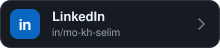
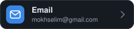
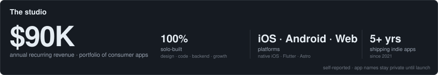
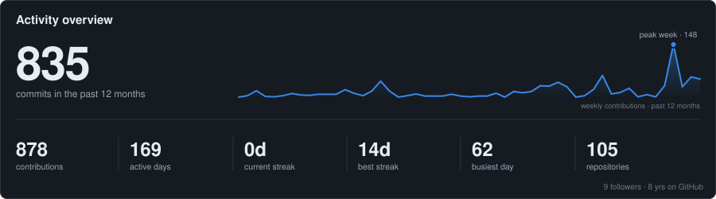
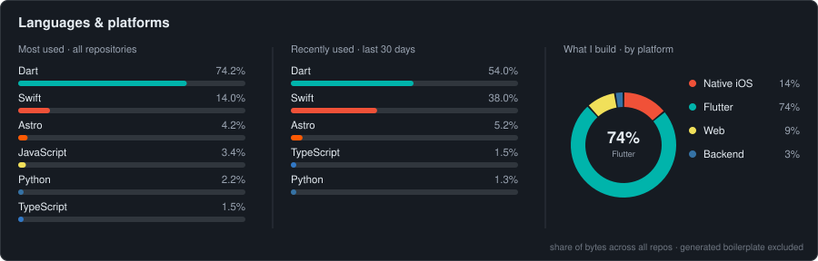
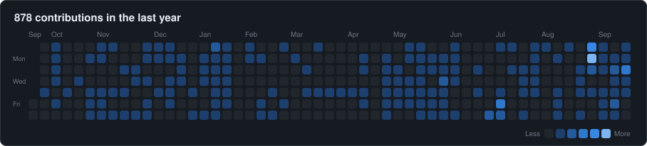
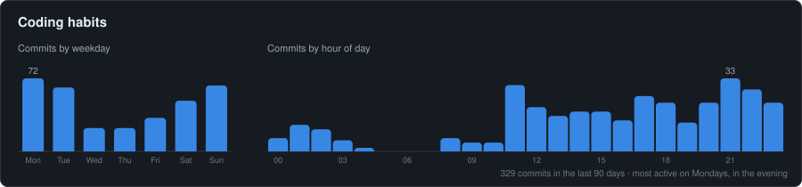

**Senior mobile engineer & indie app builder from Egypt 🇪🇬**

Shipping consumer apps end‑to‑end — product, design, code, backend, and App Store growth.

&nbsp;&nbsp;

---

<!-- Figures come from studio.json (hand-maintained) — numbers only, no app names. -->

## 🚀 What I do

I spend most of my time building and shipping iOS apps — from a blank Xcode project to a live App Store listing.
Most of that work lives in private repos, but the activity graphs below tell the story.

- 📱 **Native iOS** — SwiftUI, Widgets, Live Activities, App Intents, watchOS
- 🐦 **Flutter** — cross‑platform apps for iOS & Android, previously led a Flutter team
- 🤖 **AI features** — vision, generative models, on‑device ML, and LLM integrations
- ☁️ **Backends** — Python (FastAPI) & Node services, Firebase / Cloud Functions, deployed on Railway
- 🌐 **Web** — Astro landing pages tuned for SEO
- 📈 **ASO & growth** — keyword research, localized metadata, and store screenshots that convert

## 🧩 Currently building

> New iOS apps, in stealth until they hit the App Store. Everything stays private until launch — the graphs below are the only public trail. 👀

## 📊 Activity

<!-- Cards are generated daily by scripts/generate_metrics.py via GitHub Actions — straight from the
     GitHub API, no third-party services. Aggregate numbers + language names only. No repo names, ever. -->

---

**Open to** collaborating on mobile products, contract work, and talking shop about indie app growth.

Built with ☕ in Cairo · Stats update automatically every day

